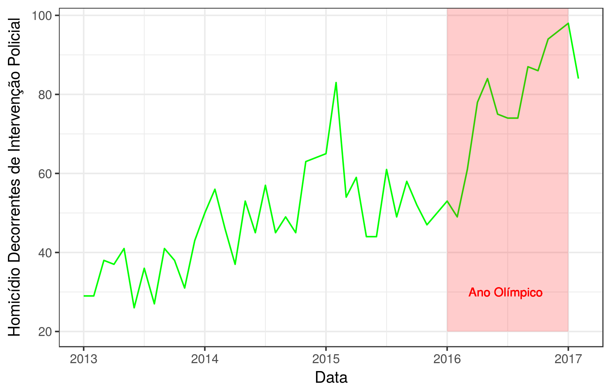

# 2017.04--Homicidios-Decorrentes-Intervencao-Policial

# Total de Homicidios Decorrentes de Intervencao Policial

## Analise
#### [blablabla?]

blalabla

###### Série Temporal dos Homicidios Decorrentes de Intervencao Policial

## Metodologia

Os dados foram pre-processados e visualizados em R. 
O script usado está disponível [aqui](https://github.com/database-RJ/2017.04--Homicidios-Decorrentes-Intervencao-Policial/blob/master/hdip.R).

## Fonte:

[Instituto de Segurança Pública - Tabelas Consolidadas](http://www.isp.rj.gov.br/Conteudo.asp?ident=108)

